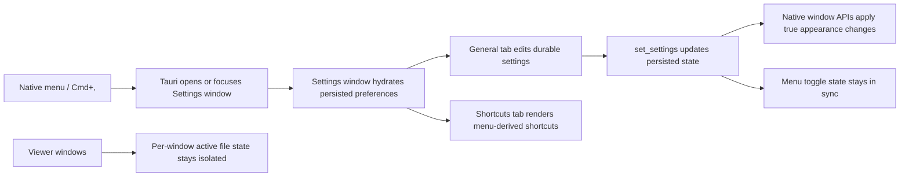

# feat: Redesign the Tauri settings surface

## Overview

Bring the active Tauri app back to a coherent settings story by replacing the current in-viewport settings modal with a dedicated native settings window, reconciling stale spec drift, isolating viewer state per window, and making durable preferences feel intentional instead of scattered across menu toggles and runtime chrome.

## Problem Frame

The v2 backlog identifies settings presentation as the first polish track because the current app feels unfinished at exactly the place users expect product quality. The active Tauri shell persists settings and exposes some toggles in the native menu, but it does not currently implement the settings panel described in OpenSpec. Meanwhile, the repo still contains older macOS-only settings UI code and archived design work, which means the project has intent but no coherent shipping settings surface.

This plan focuses on restoring a real settings experience inside the active Tauri shell without widening scope into a broader feature release. The work should make settings feel deliberately designed, resolve contradictions between current specs and current behavior, and keep the app’s small-product identity intact.

Live backlog feedback sharpened the product requirement in three ways:
- the app needs a dedicated clean configuration panel rather than a loose collection of toggles
- slideshow playback is not complete unless timing is configurable
- opacity must be exposed as a first-class user setting

Live app validation then invalidated one of the original implementation decisions:
- settings cannot live inside the current viewer viewport because they cover the image and break the product feel
- multi-window viewer state is not isolated tightly enough
- the current opacity implementation is only CSS dimming, not true native transparency

## Requirements Trace

- V2-R1. Present a minimal but clearly polished settings experience with stronger grouping, spacing, labels, and hierarchy.
- V2-R2. Make settings the clear home for durable user preferences instead of splitting them incoherently across runtime surfaces.
- V2-R3. Keep the redesign lightweight and aligned with Float’s minimal identity.
- V2-R4. Open Settings in a dedicated separate native window rather than on top of the viewer viewport.
- V2-R5. Provide slideshow timing configuration as part of the settings surface so slideshow playback is complete and understandable.
- V2-R6. Provide opacity configuration as part of the dedicated settings surface.
- V2-R7. Implement opacity as real native window transparency rather than CSS-only content dimming.
- V2-R8. Keep active image selection isolated per viewer window.
- S1. Preserve a Settings entrypoint from the native app menu / shortcut, with General and Shortcuts tabs.
- S2. Reconcile current spec drift so the settings contract matches the manual-only fit behavior and the actual Tauri implementation.
- S3. Reintroduce window appearance controls only if they can be implemented safely in the active Tauri shell with graceful platform fallback.

## Scope Boundaries

- No full redesign of runtime overlay visibility behavior beyond changes required to keep settings ownership coherent.
- No new convenience feature bucket beyond the settings work itself.
- No inline settings surface inside the image viewer as the shipping implementation.
- No framework migration or frontend stack expansion solely to build the settings UI.

## Context & Research

### Relevant Code and Patterns

- `src-tauri/src/main.rs` owns persisted settings, native menu wiring, window lifecycle, and current menu toggles for aspect lock, click-through, and slideshow.
- `dist/index.html` is the active viewer UI and currently hydrates from `get_settings`, which is part of the problem because viewer bootstrapping still depends on shared settings payloads.
- `tests/ui-mock.spec.ts` provides the existing frontend-only mock pattern for exercising `dist/index.html` without a full Tauri runtime.
- `tests/tauri-driver.spec.ts` is the current end-to-end smoke harness for the real Tauri shell.
- `src/main.rs` contains legacy macOS-only settings UI code that is useful as historical reference for separate-window settings semantics, but not as the shipping implementation path.

### Institutional Learnings

- No relevant `docs/solutions/` learnings are present in the repository.
- The archived change `openspec/changes/archive/2025-11-17-add-settings-modal-appearance-controls/` is the strongest repo-local prior art. Its proposal and design are useful references, but its rollback status is also a warning that settings work can easily break the main app flow if it is bolted on too invasively.

### External References

- None. Local repo history and current code provide enough planning signal for this pass.

## Key Technical Decisions

- Use a dedicated Tauri settings window, opened from the native menu/shortcut, instead of a modal rendered inside the viewer webview.
- Treat the clean dedicated settings window as a product requirement, not just an implementation vehicle, because slideshow timing and opacity need a coherent home.
- Resolve spec drift before implementation by aligning `settings-panel`, `settings-persistence`, and `fit-window` requirements with the current manual Fit behavior and the actual Tauri product shape.
- Treat durable preferences and session controls differently:
  - aspect lock, click-through, opacity, blur, and slideshow interval/default values belong in Settings
  - session-state toggles such as “slideshow currently running” remain runtime controls and should not define the settings IA
- Keep the viewer UI and settings UI separate so the image viewport never hosts its own configuration surface.
- Move viewer bootstrapping off shared `last_file` settings hydration so active image state remains window-scoped instead of being implied by global preferences.
- Keep appearance controls behind capability-aware application logic so unsupported blur or partial window styling support does not block the rest of the settings redesign.

## Open Questions

### Resolved During Planning

- Should the settings surface remain platform-native or become unified in the Tauri app?
  - Resolution: use a dedicated native Tauri window for Settings so configuration is separate from the viewer, while still allowing shared implementation where practical.
- How should slideshow ownership be split between Settings and runtime chrome?
  - Resolution: slideshow timing belongs in Settings, but the active on/off playback state remains session-scoped runtime state.
- Should the old “Fit window to image” toggle remain in Settings?
  - Resolution: no. The active `fit-window` spec is manual-only, so stale settings references to a persisted fit toggle must be removed from the settings contract.

### Deferred to Implementation

- Whether the dedicated settings window should be singleton-app-wide or reopened/focused from each viewer window.
- Exact Tauri window API handling for true opacity and blur on each supported platform, beyond the requirement that unsupported cases must degrade safely.
- Whether the settings window content should continue using a lightweight webview HTML surface or move closer to platform-native controls later.

## High-Level Technical Design

> *This illustrates the intended approach and is directional guidance for review, not implementation specification. The implementing agent should treat it as context, not code to reproduce.*

## Implementation Units

- [ ] **Unit 1: Reconcile the settings contract in OpenSpec**

**Goal:** Define one consistent behavior contract before UI work begins so the implementation is not built on contradictory specs.

**Requirements:** V2-R2, S1, S2, S3

**Dependencies:** None

**Files:**
- Create: `openspec/changes/redesign-settings-surface/proposal.md`
- Create: `openspec/changes/redesign-settings-surface/tasks.md`
- Create: `openspec/changes/redesign-settings-surface/specs/settings-panel/spec.md`
- Create: `openspec/changes/redesign-settings-surface/specs/settings-persistence/spec.md`
- Create: `openspec/changes/redesign-settings-surface/specs/window-appearance/spec.md`
- Create: `openspec/changes/redesign-settings-surface/specs/fit-window/spec.md`

**Approach:**
- Start by codifying the intended Tauri settings surface and explicitly removing stale references to a persisted fit toggle.
- Re-home appearance requirements into a dedicated `window-appearance` delta so settings layout and window rendering concerns are not conflated.
- Clarify which values are durable preferences versus runtime-only state so later UI work does not silently encode product decisions.

**Patterns to follow:**
- `openspec/specs/settings-panel/spec.md`
- `openspec/specs/settings-persistence/spec.md`
- `openspec/specs/fit-window/spec.md`
- `openspec/changes/archive/2025-11-17-add-settings-modal-appearance-controls/design.md`

**Test scenarios:**
- Test expectation: none -- this unit defines and validates the contract rather than changing runtime behavior.

**Verification:**
- `openspec validate redesign-settings-surface --strict` passes.
- The resulting deltas no longer conflict with the active manual-fit behavior or with the intended Tauri settings surface.

- [ ] **Unit 2: Replace the inline modal with a dedicated native settings window**

**Goal:** Restore an actual user-visible settings surface in the active Tauri shell, reachable from the native menu and shortcut, without covering the active image viewport.

**Requirements:** V2-R1, V2-R2, V2-R3, V2-R4, V2-R5, V2-R6, S1

**Dependencies:** Unit 1

**Files:**
- Modify: `src-tauri/src/main.rs`
- Create or modify: dedicated settings window UI assets under `dist/` or adjacent files
- Modify: `tests/settings-panel.spec.ts`
- Modify: `tests/tauri-driver.spec.ts`

**Approach:**
- Add a native `Settings…` menu item and shortcut handler that opens or focuses a dedicated settings window.
- Move the current settings UI out of the viewer webview so configuration no longer competes with the image viewport.
- Hydrate the settings window from persisted preferences and ensure closing it never disturbs active file viewing.
- Make slideshow timing and opacity read as intentional first-class settings, not leftover implementation details.
- Keep the settings window lightweight and native-feeling even if its content remains webview-rendered.

**Patterns to follow:**
- `src-tauri/src/main.rs` window creation, menu, and focused-window wiring
- existing settings labels and grouping in `dist/index.html` as content reference only
- `tests/tauri-driver.spec.ts` as the place to assert separate-window behavior

**Test scenarios:**
- Happy path: opening Settings from a menu-triggered event opens or focuses a separate settings window on the General tab with current persisted values.
- Happy path: switching to the Shortcuts tab shows active shortcut labels using platform conventions.
- Edge case: opening Settings with no selected file still succeeds and does not disturb the placeholder state in any viewer window.
- Integration: closing Settings returns focus to the existing viewer without resetting current file state or runtime chrome state.

**Verification:**
- A user can open Settings from the app menu / shortcut in the active Tauri app.
- The settings window renders both tabs and shows current settings values without blocking the main file-viewing flow.
- End-to-end coverage proves that Settings is separate from the viewer viewport.

- [ ] **Unit 3: Normalize settings ownership, per-window state, and native appearance**

**Goal:** Make the settings model coherent by exposing durable preferences in one place, removing stale settings assumptions, isolating viewer session state per window, and applying native appearance changes where supported.

**Requirements:** V2-R2, V2-R5, V2-R6, V2-R7, V2-R8, S2, S3

**Dependencies:** Unit 2

**Files:**
- Modify: `src-tauri/src/main.rs`
- Modify: `dist/index.html`
- Modify: `tests/settings-panel.spec.ts`
- Modify: `tests/tauri-driver.spec.ts`

**Approach:**
- Extend `PersistedState` and `SettingsUpdate` only for values that should survive restart, including appearance settings if they are implemented.
- Keep manual Fit as an action in the View menu and out of the settings model.
- Mirror durable settings in both menu state and settings-window state so there is no disagreement between the native menu and the settings surface.
- Reclassify slideshow behavior so the persisted timing/defaults are handled as preferences, while current playback state remains runtime-scoped.
- Remove shared-viewer assumptions from settings hydration so one window's active image cannot replace another window's image.
- Apply opacity through the native window layer rather than CSS opacity on the viewer frame.
- Clamp invalid persisted values defensively on load to avoid broken windows or invisible UI after migration.

**Patterns to follow:**
- `src-tauri/src/main.rs` existing `PersistedState`, `get_settings`, and `set_settings` patterns
- `openspec/changes/archive/2025-11-17-add-settings-modal-appearance-controls/design.md`

**Test scenarios:**
- Happy path: changing a durable setting in the settings window persists it and rehydrates the same value after relaunch.
- Happy path: menu toggle state and settings-window state remain synchronized for shared settings such as aspect lock and click-through.
- Happy path: changing opacity reveals content behind the Float window instead of only dimming the app UI.
- Edge case: loading an older `settings.json` without newly added fields falls back to safe defaults.
- Error path: unsupported blur capability leaves the control disabled or no-op without breaking other settings writes.
- Integration: opening an image in one window does not alter the active image in another window.
- Integration: manual Fit remains available from the View menu and is not reintroduced as a persisted settings toggle.

**Verification:**
- Durable preferences survive restart with migration-safe defaults.
- Shared settings have one source of truth across menu, settings window, and startup application logic.
- Viewer session state remains isolated per window.
- Opacity is applied through native window transparency.
- Manual Fit behavior remains unchanged.

- [ ] **Unit 4: Apply minimal-but-intentional visual polish and regression coverage**

**Goal:** Make the new settings surface feel productized rather than merely functional, while protecting the main viewer flow from regressions.

**Requirements:** V2-R1, V2-R3, V2-R4, V2-R5, V2-R6

**Dependencies:** Unit 3

**Files:**
- Modify: `dist/index.html`
- Modify: `tests/settings-panel.spec.ts`
- Modify: `tests/ui-mock.spec.ts`
- Modify: `README.md`

**Approach:**
- Use restrained grouping, spacing, labels, and helper text to make the settings surface clearly more polished without feeling heavyweight.
- Make slideshow timing and opacity visually legible as core controls inside the dedicated configuration panel.
- Keep visual language aligned with Float’s minimal dark viewer rather than introducing an unrelated design system.
- Add regression coverage for the most failure-prone interactions: settings-window opening/focus, state hydration, and controls unavailable on the current platform.
- Document the now-user-visible settings entrypoint and any user-facing appearance controls in the README once the contract is real.

**Patterns to follow:**
- Existing minimal styling patterns in `dist/index.html`
- The v2 backlog brief in `docs/brainstorms/2026-04-06-v2-polish-backlog-requirements.md`

**Test scenarios:**
- Happy path: the General tab reads as clearly grouped and legible in the dedicated settings window.
- Happy path: helper text and labels explain settings without requiring menu knowledge.
- Edge case: disabled or unavailable controls still render in a coherent, non-broken state.
- Integration: existing viewer bootstrap behavior in `tests/ui-mock.spec.ts` still passes once the inline settings modal is removed from the viewer.

**Verification:**
- The settings surface feels visually deliberate while remaining small and uncluttered.
- Existing frontend smoke coverage still passes after the modal and styling changes.
- README accurately reflects the new settings entrypoint and visible configuration surface.

## System-Wide Impact

- **Interaction graph:** native menu and shortcut handling in `src-tauri/src/main.rs` will now open or focus a dedicated settings window; settings edits will flow back through `set_settings` and then fan out to menu state, window APIs, and startup persistence.
- **Error propagation:** invalid or unsupported appearance settings should be clamped or disabled locally, never producing a fatal error that blocks file viewing.
- **State lifecycle risks:** `settings.json` migration must stop conflating shared preferences with per-window active-file state while safely defaulting any newly added fields.
- **API surface parity:** menu toggles and the settings window must remain synchronized for any setting exposed in both places.
- **Integration coverage:** end-to-end coverage should exercise startup hydration, settings-window open/focus, per-window viewer isolation, and persistence across restart for at least one durable setting.
- **Unchanged invariants:** always-on-top behavior, file selection, multi-file navigation, and manual Fit remain part of the existing viewer flow and should not change as a side effect of the settings redesign.

## Risks & Dependencies

| Risk | Mitigation |
|------|------------|
| Prior settings-modal work was rolled back after breaking the main app flow. | Land the contract first, then add the modal shell in the existing webview with focused regression coverage before extending appearance behavior. |
| Blur / appearance APIs may diverge between macOS and Windows. | Capability-gate appearance controls, keep unsupported behavior non-fatal, and preserve the rest of the settings experience even when blur is unavailable. |
| Spec drift around manual Fit and stale settings references can produce a polished UI with the wrong product contract. | Reconcile OpenSpec first and treat stale fit-toggle references as blockers for UI work. |
| Persistence changes can corrupt or invalidate existing `settings.json` files. | Use additive schema changes with safe defaults and clamp invalid values on load and write. |

## Documentation / Operational Notes

- This work should not start implementation until the corresponding OpenSpec change is reviewed and approved.
- Manual verification should include macOS and Windows checks for Settings opening, shortcut labeling, persistence across restart, and appearance fallback behavior.
- The follow-on v2 polish plan for contextual overlay behavior should reuse the settings ownership decisions made here rather than re-deciding where controls belong.

## Sources & References

- **Origin document:** `docs/brainstorms/2026-04-06-v2-polish-backlog-requirements.md`
- Related code: `src-tauri/src/main.rs`
- Related code: `dist/index.html`
- Historical reference: `src/main.rs`
- Archived prior art: `openspec/changes/archive/2025-11-17-add-settings-modal-appearance-controls/proposal.md`
- Archived prior art: `openspec/changes/archive/2025-11-17-add-settings-modal-appearance-controls/design.md`
