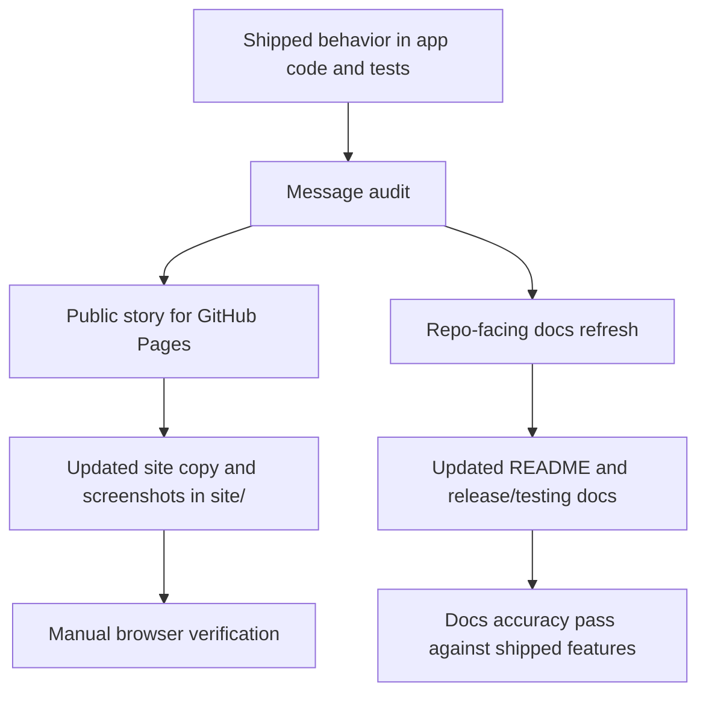

# docs: Refresh GitHub Pages and repository docs for shipped v2 polish work

## Overview

Update the public GitHub Pages site and the repo’s durable documentation so they describe the app that now exists: a minimal always-on-top image viewer with a dedicated settings window, real native opacity, configurable and looping slideshow playback, isolated multi-window state, and more intentional empty/error states.

## Problem Frame

The current public site and README still describe the older Float shape: open an image, fit it, and pin it above other apps. That was accurate before the v2 polish work landed, but it now undersells the product and leaves important behavior undocumented. The result is drift in both directions:

- the public GitHub Pages site does not communicate the dedicated settings window, slideshow improvements, native opacity, or multi-window integrity
- the README and release docs do not explain the current settings surface, the updated slideshow behavior, or the native macOS regression harness that now exists for menu-driven window targeting

This work should refresh the product story without changing the product itself. The goal is alignment, not another feature pass.

## Requirements Trace

- DOC-R1. Public-facing copy must reflect the shipped v2 polish behavior rather than the pre-polish baseline.
- DOC-R2. The GitHub Pages site must surface the features that now define the release: dedicated settings window, slideshow timing, looping slideshow, real opacity, multi-window isolation, and polished viewer states. (see origin: `docs/brainstorms/2026-04-06-v2-polish-backlog-requirements.md`)
- DOC-R3. Public copy must preserve Float’s minimal identity and avoid presenting it as a broader asset manager or workflow suite. (see origin: `docs/brainstorms/2026-04-06-v2-polish-backlog-requirements.md`)
- DOC-R4. Repository docs must explain the current end-user behavior and current verification workflows, including the macOS-native open-target harness where appropriate.
- DOC-R5. Release and install documentation must keep the existing stable download links, asset names, and platform support language intact unless the implementation actually changed them.
- DOC-R6. Documentation must avoid overclaiming capability-gated or secondary behavior, especially blur support and any platform-specific nuance that is not uniformly available.

## Scope Boundaries

- No product behavior changes, UI refactors, or release-pipeline changes.
- No new marketing site framework or content system.
- No screenshot-generation automation unless it is already necessary to produce stable updated assets.
- No broad rewrite of OpenSpec or planning documents beyond referencing them when they define the product story.

## Context & Research

### Relevant Code and Content Surfaces

- `site/index.html` is the GitHub Pages landing page and currently highlights the older “open, fit, pin” story with generic image examples.
- `site/styles.css` defines the visual layout for the public site and will need corresponding layout support if the content structure changes.
- `README.md` is the primary repository-facing product and setup document; it still lists only the older baseline feature set and older UI-test guidance.
- `docs/releasing.md` contains the public-release checklist and should verify the newly visible behaviors that matter to the release story.
- `dist/settings.html` is now the real settings surface and confirms the shipped dedicated settings window with `Behavior` and `Appearance` tabs.
- `src-tauri/src/main.rs` is the source of truth for shipped behavior such as persisted slideshow interval, native opacity, settings-window lifecycle, and wrapped previous/next navigation.
- `tests/settings-panel.spec.ts`, `tests/ui-mock.spec.ts`, and `tests/tauri-driver.spec.ts` show the currently exercised behavior and are useful as accuracy references even if this plan does not add new automated tests.
- `justfile` now includes `tauri-check-open-target`, which is relevant documentation material for developer verification on macOS.

### Institutional Learnings

- `docs/solutions/developer-experience/macos-tauri-feedback-loop-2026-04-07.md` documents the deterministic native macOS harness for menu-driven multi-window verification. That learning should inform the README or testing guidance rather than remain isolated as tribal knowledge.

### External References

- None. This is a repo-alignment task, and the local code plus existing docs provide enough signal.

## Key Technical Decisions

- Treat the shipped implementation as the source of truth for messaging, with the v2 backlog used to frame why the work matters.
- Update both copy and visuals on the GitHub Pages site; text-only refresh would still leave the landing page visually anchored to the old app story.
- Prefer real product screenshots or clearly implementation-grounded assets over abstract marketing language, especially for the settings window and polished viewer states.
- Keep blur out of headline public messaging because it is capability-gated and not central to the release story.
- Mention the macOS native regression harness in developer docs, not in end-user-facing marketing copy.
- Preserve existing download URLs, release asset names, and support matrix text unless the implementation changed those contracts.

## Open Questions

### Resolved During Planning

- Should the public site emphasize blur alongside opacity?
  - Resolution: no. Opacity is the stable user-facing improvement; blur is secondary and platform-dependent.
- Should the docs refresh include developer-verification tooling or stay end-user-only?
  - Resolution: include it in repo docs because it is now part of the real maintenance workflow, but keep it out of the public landing page.

### Deferred to Implementation

- Which exact live screenshots best represent the refreshed product story without cluttering the landing page.
- Whether the best site treatment is a new “What’s new in v2” band, a rewritten feature runway, or a tighter hybrid of both.

## High-Level Technical Design

> This is directional guidance for execution, not implementation specification.

## Implementation Units

- [ ] **Unit 1: Define the refreshed public feature narrative and visual inventory**

**Goal:** Produce one accurate feature story for the release so the site and docs stop diverging.

**Requirements:** DOC-R1, DOC-R2, DOC-R3, DOC-R6

**Dependencies:** None

**Files:**
- Modify: `README.md`
- Modify: `site/index.html`
- Reference only: `dist/settings.html`
- Reference only: `src-tauri/src/main.rs`
- Reference only: `tests/settings-panel.spec.ts`
- Reference only: `tests/ui-mock.spec.ts`

**Approach:**
- Audit the now-shipped behaviors and collapse them into a concise public story centered on polish, not scope expansion.
- Decide which features deserve headline treatment versus supporting detail:
  - headline: dedicated settings window, real opacity, slideshow timing + looping, multi-window integrity
  - supporting detail: contextual runtime chrome, polished empty/missing/failed states
- Identify where the current site needs new screenshots or replacement assets because the existing gallery only shows sample images, not the updated product surfaces.
- Align wording across the site and README so the same core claims appear in both places.

**Patterns to follow:**
- Current product framing in `site/index.html`
- Minimal product identity in `docs/brainstorms/2026-04-06-v2-polish-backlog-requirements.md`
- Shipped settings surface in `dist/settings.html`

**Test scenarios:**
- Content audit: every promoted feature claim on the site or in the README maps back to shipped behavior in `src-tauri/src/main.rs`, `dist/settings.html`, or the current tests.
- Content audit: blur is not promoted as a primary feature or described without platform nuance.
- Editorial check: the release still reads as a refinement of Float, not a new product category.

**Verification:**
- No new automated test file is required for this audit unit.
- The selected public feature set is traceable to current implementation and consistent across the planned edit targets.

- [ ] **Unit 2: Refresh the GitHub Pages landing page and visual assets**

**Goal:** Make the public landing page reflect the current app and show the new polish work credibly.

**Requirements:** DOC-R1, DOC-R2, DOC-R3, DOC-R5, DOC-R6

**Dependencies:** Unit 1

**Files:**
- Modify: `site/index.html`
- Modify: `site/styles.css`
- Create or replace as needed: `site/assets/*`

**Approach:**
- Rewrite the hero and feature sections around the shipped product story instead of the older generic utility framing.
- Add or replace visual assets so the page can show the dedicated settings window or another clearly updated app state, not only floating reference images.
- Keep download CTAs, release URLs, and install guidance stable while refreshing the descriptive copy around them.
- Preserve the existing site’s restrained style, but let the content structure breathe enough to show what actually changed in v2.

**Patterns to follow:**
- Existing layout and CTA structure in `site/index.html`
- Existing design language in `site/styles.css`
- Current release asset contract in `README.md` and `docs/releasing.md`

**Test scenarios:**
- Happy path: the landing page hero and feature sections mention the new settings window, slideshow control, native opacity, and multi-window safety without overexplaining.
- Happy path: any new screenshots or assets load correctly and support the claims they accompany.
- Edge case: download buttons and release links still target the stable GitHub Release assets.
- Edge case: the refreshed layout remains readable on mobile and desktop widths and does not regress the current site navigation or CTA visibility.

**Verification:**
- No repo test file change is required; verify manually in a browser against the generated `site/` output.
- Confirm at minimum:
  - hero copy matches shipped behavior
  - new assets render without broken paths
  - responsive layout remains usable at narrow and wide widths
  - all release/download links remain unchanged and correct

- [ ] **Unit 3: Refresh repository docs for end-user behavior, testing, and release verification**

**Goal:** Make the README and release docs match the current product surface and the real maintenance workflow.

**Requirements:** DOC-R1, DOC-R4, DOC-R5, DOC-R6

**Dependencies:** Unit 1

**Files:**
- Modify: `README.md`
- Modify: `docs/releasing.md`
- Reference only: `docs/solutions/developer-experience/macos-tauri-feedback-loop-2026-04-07.md`
- Reference only: `justfile`
- Reference only: `tests/tauri-driver.spec.ts`

**Approach:**
- Update the README feature list so it reflects the shipped settings window, configurable slideshow timing, looping slideshow, native opacity, multi-window isolation, and polished viewer states.
- Refresh the testing section so it documents the current split between Playwright/Tauri-driver coverage and the macOS-native `tauri-check-open-target` harness.
- Update release-checklist language to verify the newly documented behaviors, especially settings, opacity, slideshow timing/looping, and multi-window targeting.
- Keep install, packaging, and release asset instructions stable unless they truly changed.

**Patterns to follow:**
- Existing section structure in `README.md`
- Existing checklist structure in `docs/releasing.md`
- Native-feedback-loop guidance in `docs/solutions/developer-experience/macos-tauri-feedback-loop-2026-04-07.md`

**Test scenarios:**
- Content audit: README commands still match the repo’s actual entrypoints and test commands.
- Content audit: the testing section distinguishes cross-platform Playwright coverage from the macOS-only native harness.
- Content audit: the release checklist includes the user-visible v2 polish behaviors that the public site now advertises.
- Editorial check: developer docs remain concise and operational rather than turning into a narrative changelog.

**Verification:**
- No new automated test file is required for this documentation unit.
- Manually confirm that every command, path, and asset name mentioned in `README.md` and `docs/releasing.md` exists and matches the repo.

## Cross-Cutting Concerns

- **Accuracy over ambition:** documentation must describe shipped behavior only; anything still conditional or platform-gated should be phrased conservatively.
- **Visual proof:** if the site starts making stronger claims, it needs screenshots or assets that support those claims.
- **Platform nuance:** opacity is broadly promotable; blur is not. The docs should reflect that distinction cleanly.
- **Story coherence:** the site, README, and release checklist should all tell the same story about what changed in this polish pass.

## Risks and Mitigations

| Risk | Mitigation |
| --- | --- |
| The site copy overclaims behavior that is only partially implemented or platform-dependent. | Trace every promoted claim back to current code and tests before shipping the copy update. |
| New screenshots quickly drift or fail to match the current UI. | Prefer a small number of high-signal assets and capture from the current app state late in the implementation pass. |
| README testing guidance becomes confusing by mixing Tauri-driver and the macOS-only native harness. | Separate the two paths explicitly by purpose and platform. |
| The site refresh changes product tone from “minimal utility” to “feature list.” | Keep the hero and runway copy focused on why the polish matters, not on enumerating every control. |

## Sequencing

1. Complete the feature and screenshot audit first so the story is grounded in shipped behavior.
2. Refresh the GitHub Pages landing page and assets once the narrative is settled.
3. Refresh README and release docs after the public messaging is stable so the repo docs inherit the same wording and emphasis.

## Acceptance Criteria

- The GitHub Pages site clearly reflects the shipped v2 polish work and no longer reads like the pre-settings version of Float.
- The site still feels minimal, retains the current download and release link structure, and uses visuals that match the shipped app.
- `README.md` accurately documents the current feature set, current settings surface, and current test/verification entrypoints.
- `docs/releasing.md` verifies the behaviors that the refreshed public site now promotes.

## References

- Origin requirements: `docs/brainstorms/2026-04-06-v2-polish-backlog-requirements.md`
- Prior implementation plan: `docs/plans/2026-04-06-001-feat-v2-settings-polish-plan.md`
- Native verification learning: `docs/solutions/developer-experience/macos-tauri-feedback-loop-2026-04-07.md`
- Public site: `site/index.html`
- Public site styles: `site/styles.css`
- README: `README.md`
- Release guide: `docs/releasing.md`
